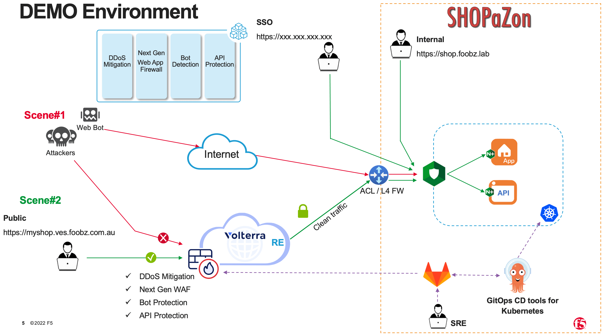
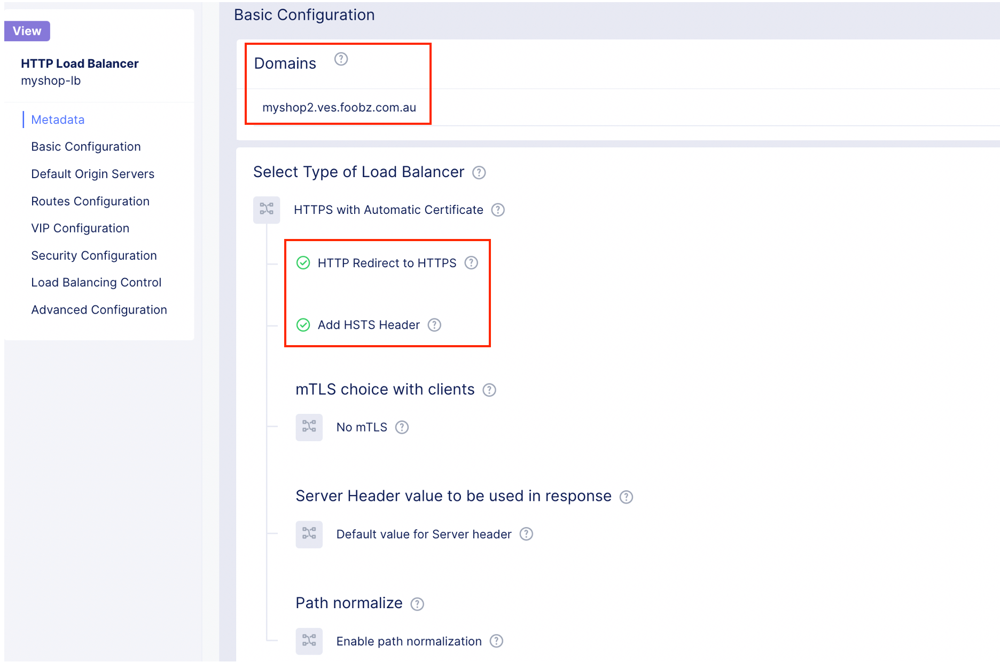
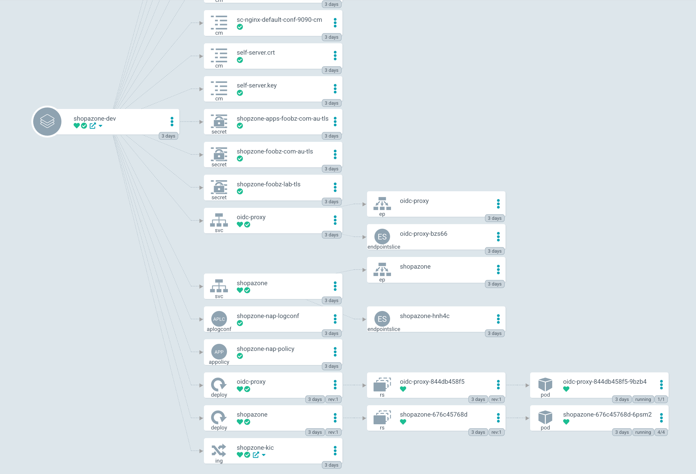

# F5 Distributed Cloud WAAP - myshop-waap
This is an example/demo terraform plan to provision the following capabilities on F5 Distributed Cloud WAAP
###### WAAP - Web Application Firewall
###### WAAP - Bot Protections (Signature based bot)
###### WAAP - API Protections/Security
###### WAAP - L7 DDoS 

Additional capabilites such as Machine Learning configuration for API Discovery will be enabled as part of the terraform plan. (add-ons capabilites).

Use the folloing command to extract .p12 certificate to an individual certificate and private key

> openssl pkcs12 -info -in f5-apac-sp.console.ves.volterra.io.api-creds.p12 -out certificate.cert -nokeys

> openssl pkcs12 -info -in f5-apac-sp.console.ves.volterra.io.api-creds.p12 -out private_key.key -nodes -nocerts

## Prerequsite
- F5XC tenant
- Download .p12 key (please refer to official documentation)
- Git repo (either github or gitlab). This demo based on gitlab
- NGINX Ingress controller with NGINX App Protect (for 2-tier WAF)
- ArgoCD - Delcarative GitOps CD for Kubernetes (https://github.com/argoproj/argo-cd)

<!-- BEGIN_TF_DOCS -->
## Terraform Requirements

| Name | Version |
|------|---------|
|  [terraform](#requirement\_terraform) | >= 0.12.9, != 0.13.0 |
|  [kubectl](#requirement\_kubectl) | >= 1.7.0 |
|  [volterra](#requirement\_volterra) | >=0.0.6 |

## Providers

| Name | Version |
|------|---------|
|  [kubectl](#provider\_kubectl) | 1.13.1 |
|  [volterra](#provider\_volterra) | 0.11.6 |

## Modules

No modules.

## Resources

| Name | Type |
|------|------|
| [kubectl_manifest.myshop-dev](https://registry.terraform.io/providers/gavinbunney/kubectl/latest/docs/resources/manifest) | resource |
| [volterra_api_definition.myshop-apidef](https://registry.terraform.io/providers/volterraedge/volterra/latest/docs/resources/api_definition) | resource |
| [volterra_app_firewall.this](https://registry.terraform.io/providers/volterraedge/volterra/latest/docs/resources/app_firewall) | resource |
| [volterra_healthcheck.this](https://registry.terraform.io/providers/volterraedge/volterra/latest/docs/resources/healthcheck) | resource |
| [volterra_http_loadbalancer.this](https://registry.terraform.io/providers/volterraedge/volterra/latest/docs/resources/http_loadbalancer) | resource |
| [volterra_origin_pool.this](https://registry.terraform.io/providers/volterraedge/volterra/latest/docs/resources/origin_pool) | resource |
| [volterra_service_policy.myshop-sp](https://registry.terraform.io/providers/volterraedge/volterra/latest/docs/resources/service_policy) | resource |
| [kubectl_path_documents.manifests](https://registry.terraform.io/providers/gavinbunney/kubectl/latest/docs/data-sources/path_documents) | data source |

## Inputs

| Name | Description | Type | Default | Required |
|------|-------------|------|---------|:--------:|
|  [api\_cert](#input\_api\_cert) | n/a | `string` | `"./certificate.cert"` | no |
|  [api\_key](#input\_api\_key) | n/a | `string` | `"./private_key.key"` | no |
|  [api\_url](#input\_api\_url) | n/a | `string` | `"https://f5-apac-sp.console.ves.volterra.io/api"` | no |
|  [app\_domain](#input\_app\_domain) | FQDN for the app. | `list` | <pre>[   "myshop2.ves.foobz.com.au" ]</pre> | no |
|  [client\_certificate](#input\_client\_certificate) | n/a | `string` | `"LS0tLS1CRUdJTiBDRVJUSUZJQ0FURS0tLS0tCk1JSUJrVENDQVRlZ0F3SUJBZ0lJVm1QakN2VzdvRkl3Q2dZSUtvWkl6ajBFQXdJd0l6RWhNQjhHQTFVRUF3d1kKYXpOekxXTnNhV1Z1ZEMxallVQXhOakl4TWpReU56Z3dNQjRYRFRJeE1EVXhOekE1TVRNd01Gb1hEVEl6TURNdwpNVEF6TURJek0xb3dNREVYTUJVR0ExVUVDaE1PYzNsemRHVnRPbTFoYzNSbGNuTXhGVEFUQmdOVkJBTVRESE41CmMzUmxiVHBoWkcxcGJqQlpNQk1HQnlxR1NNNDlBZ0VHQ0NxR1NNNDlBd0VIQTBJQUJBK1pDeXp3Vm5aY1BHNmYKcWVLSjRSM3ZBY2M1dzhJS1hteE9IdFRRVGpKVG4rdXNFL3VDSGNrVFBxRU1PbldRc0hZYlR3T3VhVUo3MGZlSwo5SzFPZkhDalNEQkdNQTRHQTFVZER3RUIvd1FFQXdJRm9EQVRCZ05WSFNVRUREQUtCZ2dyQmdFRkJRY0RBakFmCkJnTlZIU01FR0RBV2dCVFFTSnF4K1JXMnpsMytlRG9MZllqWG94d253akFLQmdncWhrak9QUVFEQWdOSUFEQkYKQWlBci9HdmJkbWtFRkJlSVVBMEdTd2oyZ0FGcmxXSnY5VDB0YmFnWG1WTkMzUUloQVA3aUh6Nk9sajN6YWk4VwowRnBCaElJWXdrWDJxeVdaSysyUjFaL2FoNjBiCi0tLS0tRU5EIENFUlRJRklDQVRFLS0tLS0KLS0tLS1CRUdJTiBDRVJUSUZJQ0FURS0tLS0tCk1JSUJlRENDQVIyZ0F3SUJBZ0lCQURBS0JnZ3Foa2pPUFFRREFqQWpNU0V3SHdZRFZRUUREQmhyTTNNdFkyeHAKWlc1MExXTmhRREUyTWpFeU5ESTNPREF3SGhjTk1qRXdOVEUzTURreE16QXdXaGNOTXpFd05URTFNRGt4TXpBdwpXakFqTVNFd0h3WURWUVFEREJock0zTXRZMnhwWlc1MExXTmhRREUyTWpFeU5ESTNPREF3V1RBVEJnY3Foa2pPClBRSUJCZ2dxaGtqT1BRTUJCd05DQUFReVFFZC9ReGdxR2lRL1ZWRWliOGZqQnhDNGF3QVh4T3huNFMrQ0ZqckEKZTVYUWtSNGRhZ0IwY2F4RTNqRVZKUnFCTXM1aXpkejlNSVFZWERDWjBPVmZvMEl3UURBT0JnTlZIUThCQWY4RQpCQU1DQXFRd0R3WURWUjBUQVFIL0JBVXdBd0VCL3pBZEJnTlZIUTRFRmdRVTBFaWFzZmtWdHM1ZC9uZzZDMzJJCjE2TWNKOEl3Q2dZSUtvWkl6ajBFQXdJRFNRQXdSZ0loQU5nUXVtYVhWem5ZYTA4clJxK2ljOFdCV1g0cE1xR0wKTnBJcC9SdzFPcG5qQWlFQSs1WWVTRG0zeHY3b2plU1RrSEttQzRYRFptcHl4TmdDZmV3RjdPbUVDT1k9Ci0tLS0tRU5EIENFUlRJRklDQVRFLS0tLS0K"` | no |
|  [client\_key](#input\_client\_key) | n/a | `string` | `"LS0tLS1CRUdJTiBFQyBQUklWQVRFIEtFWS0tLS0tCk1IY0NBUUVFSUl0T1ZUWFRQWENIR3NKcXZxM3pSSzRvT3JYd2JkR1lmcVRRUXliSnRRdk1vQW9HQ0NxR1NNNDkKQXdFSG9VUURRZ0FFRDVrTExQQldkbHc4YnArcDRvbmhIZThCeHpuRHdncGViRTRlMU5CT01sT2Y2NndUKzRJZAp5Uk0rb1F3NmRaQ3dkaHRQQTY1cFFudlI5NHIwclU1OGNBPT0KLS0tLS1FTkQgRUMgUFJJVkFURSBLRVktLS0tLQo="` | no |
|  [cluster\_ca\_certificate](#input\_cluster\_ca\_certificate) | n/a | `string` | `"LS0tLS1CRUdJTiBDRVJUSUZJQ0FURS0tLS0tCk1JSUJkekNDQVIyZ0F3SUJBZ0lCQURBS0JnZ3Foa2pPUFFRREFqQWpNU0V3SHdZRFZRUUREQmhyTTNNdGMyVnkKZG1WeUxXTmhRREUyTWpFeU5ESTNPREF3SGhjTk1qRXdOVEUzTURreE16QXdXaGNOTXpFd05URTFNRGt4TXpBdwpXakFqTVNFd0h3WURWUVFEREJock0zTXRjMlZ5ZG1WeUxXTmhRREUyTWpFeU5ESTNPREF3V1RBVEJnY3Foa2pPClBRSUJCZ2dxaGtqT1BRTUJCd05DQUFRRnVUdkhpNmJDZVJPWS93OVRhSWVZUGtNVTl4aWdVdElDNmdtUFc0MjYKbVN2QWlhdUcyVE1teVZtaFJCaHN5WFMvdWhiSlp0eWN4KzJvejJpYVdUUy9vMEl3UURBT0JnTlZIUThCQWY4RQpCQU1DQXFRd0R3WURWUjBUQVFIL0JBVXdBd0VCL3pBZEJnTlZIUTRFRmdRVTY2eGJHLzdzRGFVaTUrRDh4ZGtJCmIxamJQUlV3Q2dZSUtvWkl6ajBFQXdJRFNBQXdSUUlnSUlYVWhGdThiOFAxYi81RmJWeWMyOEFLTnRzZFdwZmMKdG9CTDFlZ0MwQjBDSVFESzRHdUhJcUFaYnN1aU9aNVB4Y2NUQzdRNzAyVmNBTEVKUC9mbDNCaGl3QT09Ci0tLS0tRU5EIENFUlRJRklDQVRFLS0tLS0K"` | no |
|  [enable\_hsts](#input\_enable\_hsts) | Flag to enable hsts for HTTPS loadbalancer | `bool` | `true` | no |
|  [enable\_redirect](#input\_enable\_redirect) | Flag to enable http redirect to HTTPS loadbalancer | `bool` | `true` | no |
|  [host](#input\_host) | n/a | `string` | `"https://192.168.101.73:6443"` | no |
|  [origin\_server\_dns\_name](#input\_origin\_server\_dns\_name) | Origin server's publicly resolvable dns name | `list` | <pre>[   "shop-dev.foobz.com.au" ]</pre> | no |
|  [origin\_server\_sni](#input\_origin\_server\_sni) | Origin server's SNI value | `string` | `""` | no |
|  [volterra\_namespace](#input\_volterra\_namespace) | F5XC app namespace where the object will be created. This cannot be system or shared ns. | `string` | `"myshop"` | no |
|  [volterra\_namespace\_exists](#input\_volterra\_namespace\_exists) | Flag to create or use existing volterra namespace | `string` | `true` | no |
|  [web\_app\_name](#input\_web\_app\_name) | Web App Name. Also used as a prefix in names of related resources. | `string` | `"myshop"` | no |

## Outputs

| Name | Description |
|------|-------------|
|  [f5\_distributed\_cloud\_protected\_app\_url](#output\_f5\_distributed\_cloud\_protected\_app\_url) | Domain VIP to access the web app |
<!-- END_TF_DOCS -->

### Example output from this terraform plan

